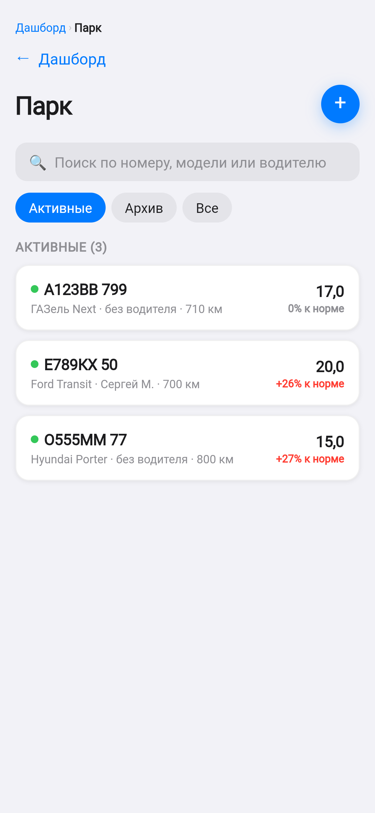

# Поток

**Показывает, где в автопарке течёт топливо и сколько это стоит в рублях.**

Цифровая камера в бензобаке: считает, сколько машина должна была потратить по
пробегу и норме, сверяет с фактическими заправками и при расхождении пишет
владельцу в Telegram.

## Для кого

Для парков от десяти до полутора сотен машин, где топливо — самая большая
статья расходов и самая непрозрачная. Для владельца, который видит только
итоговую сумму в конце месяца, и для диспетчера, который знает свои машины, но
не может доказать перерасход цифрами.

## Что умеет

- **Сверяет пробег с заправками.** Машина проехала 400 км, норма 14 л на сотню
  — должно быть 56 литров. Залито 118. Разница видна в тот же день, а не в
  конце месяца.
- **Пишет в Telegram, когда что-то не так.** Заправка ночью, залито больше
  объёма бака, расход выше нормы — сообщение приходит сразу, с номером машины
  и суммой.
- **Считает, сколько удалось сэкономить.** Каждый разобранный случай остаётся с
  цифрой: на главном экране видно, сколько парк сберёг с начала работы.
- **Читает выгрузки с заправок.** Файл от топливной карты загружается целиком;
  незнакомые колонки приложение спросит один раз и запомнит.
- **Готовит бумаги бухгалтеру.** Акт списания ГСМ, путевые листы, расходы сверх
  топлива, закрытие месяца и выгрузка всего периода одной книгой.
- **Напоминает о ТО до поломки.** Замена масла, тормоза, осмотр — по пробегу
  или по сроку, с запасом в километрах.
- **Работает без связи.** В гараже и на трассе интернет пропадает; запись
  заправки не теряется и уходит сама, когда сеть вернётся.

## Как это выглядит в работе

| | |
|---|---|
|  | **Тревоги.** «Ночная заправка в 02:21 на 74,2 л, АЗС Газпромнефть, МКАД 41 км. За 7 дней — 2 ночные заправки». Не «что-то не так», а что именно, где и сколько раз. |
|  | **Парк.** Сколько машина съедает на сотню и насколько это выше нормы. Красное — то, с чем нужно разбираться сегодня. |
|  | **Заправки.** Каждая с одометром, станцией и пометкой, если с ней что-то не так: ночная, несколько за день, больше бака. |

## Каждому своё окно

Владелец видит деньги парка. Диспетчер — машины, рейсы и людей. Бухгалтер —
документы и закрытие месяца. Механик — регламенты и заявки о поломках.
Водитель — только свою машину и свою заправку, в три касания.

## Статус

Продукт работает целиком: приложение, веб-кабинет, оповещения, документы.
Сейчас ищем первые парки, чтобы пройти его на настоящих данных и настоящих
выгрузках с заправок. Если у вас парк — напишите, покажем на ваших числах.

## Связь

[Telegram — @dotnotfact](https://t.me/dotnotfact) · [другие проекты на GitHub](https://github.com/DotNotFact)
