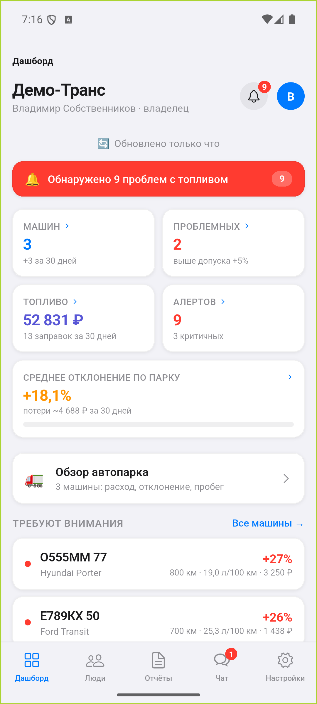
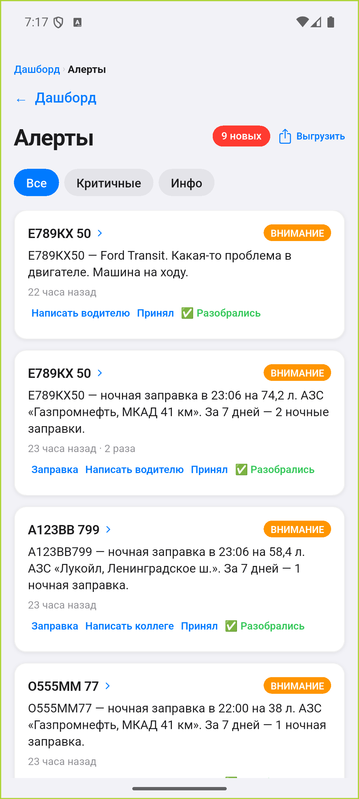
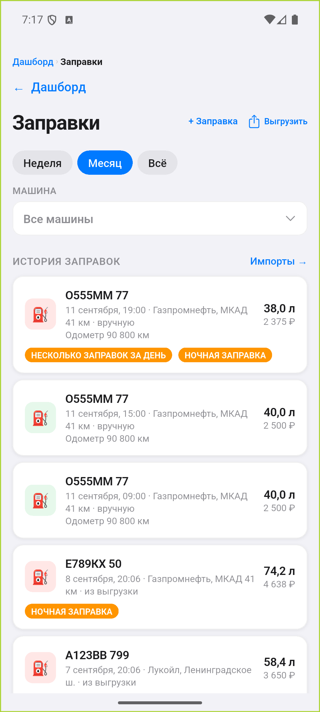
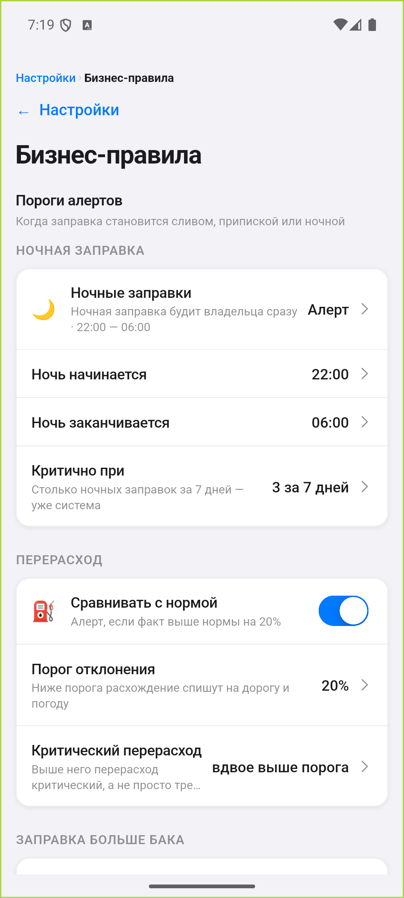
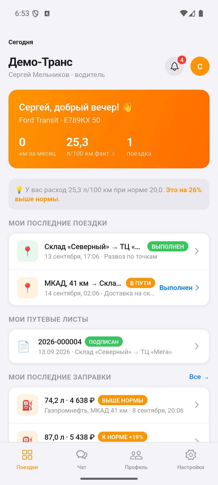
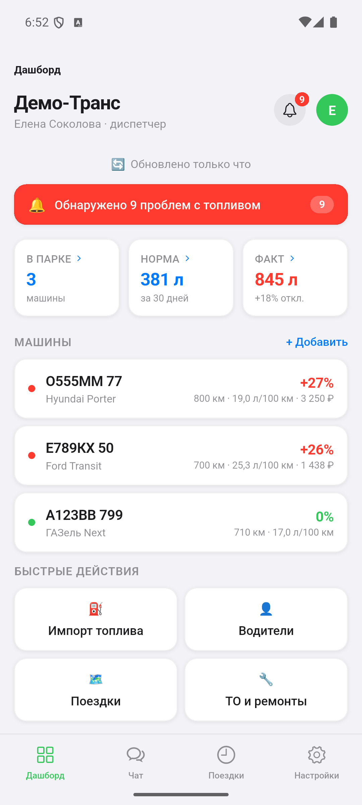
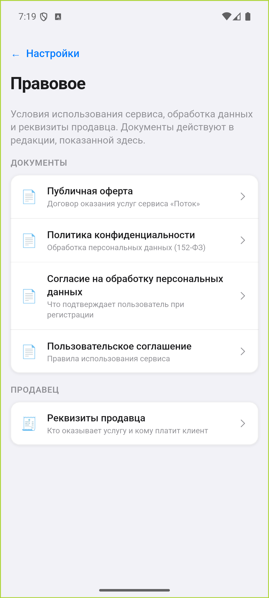

# Поток

**Показывает, где в автопарке течёт топливо и сколько это стоит в рублях.**

Цифровая камера в бензобаке: считает, сколько машина должна была потратить по
пробегу и норме, сверяет с фактическими заправками и при расхождении пишет
владельцу в Telegram.

Первый экран отвечает на один вопрос: **где течёт и сколько это стоит.** Девять
проблем с топливом, среднее отклонение по парку +18,1%, потери около 4 688 ₽ за
тридцать дней — и сразу ниже машины, с которыми нужно разобраться сегодня.

## Для кого

Для парков от десяти до полутора сотен машин, где топливо — самая большая
статья расходов и самая непрозрачная. Для владельца, который видит только
итоговую сумму в конце месяца, и для диспетчера, который знает свои машины, но
не может доказать перерасход цифрами.

## Что умеет

- **Сверяет пробег с заправками.** Машина проехала 400 км, норма 14 л на сотню
  — должно быть 56 литров. Залито 118. Разница видна в тот же день, а не в
  конце месяца.
- **Пишет в Telegram, когда что-то не так.** Заправка ночью, залито больше
  объёма бака, расход выше нормы — сообщение приходит сразу, с номером машины
  и суммой.
- **Считает, сколько удалось сэкономить.** Каждый разобранный случай остаётся с
  цифрой: на главном экране видно, сколько парк сберёг с начала работы.
- **Читает выгрузки с заправок.** Файл от топливной карты загружается целиком;
  незнакомые колонки приложение спросит один раз и запомнит.
- **Готовит бумаги бухгалтеру.** Акт списания ГСМ, путевые листы, расходы сверх
  топлива, закрытие месяца и выгрузка всего периода одной книгой.
- **Напоминает о ТО до поломки.** Замена масла, тормоза, осмотр — по пробегу
  или по сроку, с запасом в километрах.
- **Работает без связи.** В гараже и на трассе интернет пропадает; запись
  заправки не теряется и уходит сама, когда сеть вернётся.

## Как это выглядит в работе

Снимки — с настоящего приложения на живых данных, а не рисунки.

| | |
|---|---|
|  | **Тревоги.** «Ночная заправка в 23:06 на 74,2 л, АЗС Газпромнефть, МКАД 41 км. За 7 дней — 2 ночные заправки». Не «что-то не так», а что именно, где и сколько раз. Рядом — что с этим делать: написать водителю, принять, «разобрались». |
|  | **Заправки.** Каждая с литрами, суммой, одометром и станцией. Видно и откуда она взялась: внесли вручную или подтянули из выгрузки с АЗС. Подозрительные помечены прямо в строке — ночная, несколько за день. |
|  | **Правила задаёт владелец, а не разработчик.** Когда начинается ночь, сколько ночных заправок за неделю — уже система, при каком отклонении поднимать тревогу и с какого порога перерасход считается критическим. Самосвал и легковая живут по разным числам. |
|  | **Водителю — своё.** Не урезанная копия кабинета владельца: его машина, его расход против нормы («25,3 при норме 20,0 — на 26% выше»), его рейсы со статусом, путевые листы и заправки с фото чека. Одной рукой, в три касания. |
|  | **Диспетчеру — своё.** Норма против факта по парку за месяц, машины с отклонением и быстрые действия смены: импорт топлива, водители, поездки, ТО. |
|  | **Один телефон на смену.** В парке телефон нередко делят, поэтому вход помнит тех, кто уже заходил: роль меняется плашкой, а не набором номера заново. |
|  | **Документы на виду.** Оферта, политика по 152-ФЗ, согласие на обработку персональных данных и реквизиты продавца открываются прямо из приложения — в том числе до входа. Геотрек водителя в политике назван персональными данными прямо. |

## Каждому своё окно

Владелец видит деньги парка. Управляющий — то же плюс людей и правила.
Диспетчер — машины, рейсы и переписку с водителями. Бухгалтер — документы,
расходы и закрытие месяца. Водитель — только свою машину и свою заправку.

Права решает сервер, а не приложение: бухгалтер не увидит чужой парк, даже если
знает адрес экрана.

## Статус

Продукт работает целиком: приложение, оповещения в Telegram, документы,
напоминания о ТО. Клиенты пользуются **мобильным приложением** — отдельного
веб-кабинета нет намеренно: парк живёт в кабине и в гараже, а не за рабочим
столом.

Сейчас ищем первые парки, чтобы пройти сервис на настоящих данных и настоящих
выгрузках с заправок. Если у вас парк — напишите, покажем на ваших числах.

## Связь

[Telegram — @dotnotfact](https://t.me/dotnotfact) · [другие проекты на GitHub](https://github.com/DotNotFact)
